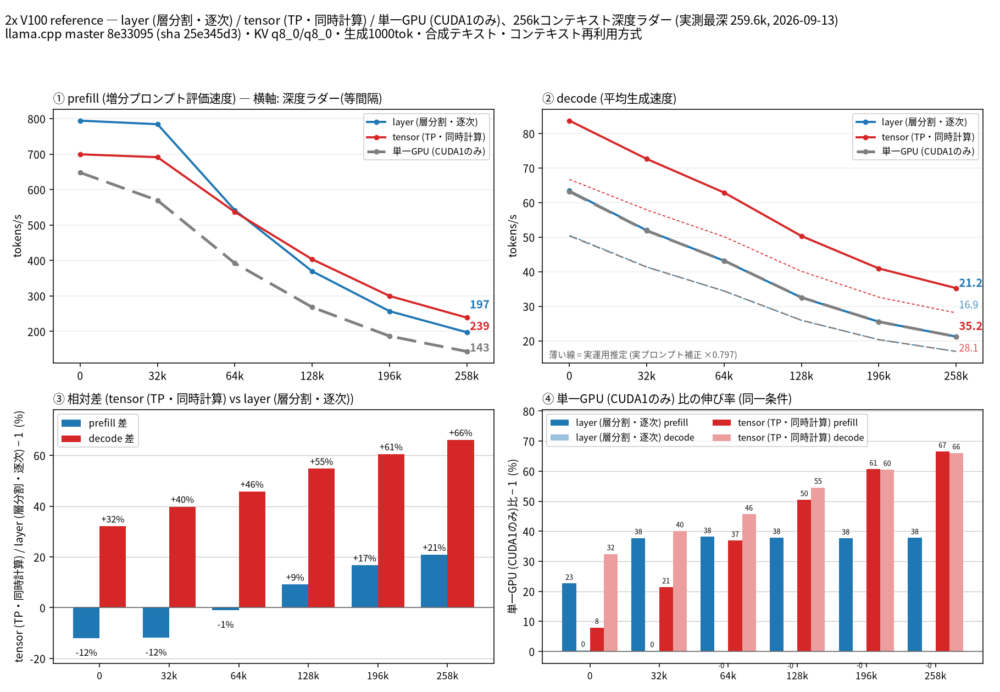

**English version → [README.md](README.md)**

# llama-split-bench

**マルチGPUマシンで、llama.cppの `--split-mode layer`(パイプライン分割・デフォルト)と `--split-mode tensor`(TP)のどちらが実際に速いのか**、そして2枚目以降のGPUがどれだけ効くのかを計測するツールです。

設定ファイル1つ、コマンド1つで、調整は不要です。各モードについて目的のコンテキストサイズまでの深度ラダーを実行し、prefill / decode スループット(投機デコードの採択率込み)を記録し、実プロンプト計測でdecodeを補正し、比較図(日本語・英語)を自動生成します。



*参考例: Tesla V100 ×2 (PG500-216 + V100-PCIE、PCIe 3.0 x8/x8、NVLinkなし)、Qwen3.8-27B UD-Q4_K_M、262kコンテキスト。結果: tensor分割は全深度でdecodeが勝ち(深さ0で +32% → 260kで +66%)。layer分割のdecodeは単一GPUと同一で、分割は「速度」ではなく「VRAM」を買うものだと分かります。*

## 計測内容(この方式にした理由)

1. **深度ラダー(コンテキスト再利用)** — サーバには段階ごとに伸びる1本のプロンプトを送ります(0 → 32k → … → target)。各段で*増分*のprefill速度(`prompt_per_second`)を記録し、続けてNトークン(`ignore_eos`、既定1000)を生成した定常速度がdecode(`predicted_per_second`)です。実際のエージェント利用(長いプロンプト→深い位置での生成)を模した形です。
2. **深さ0のprefill(新規プロンプト)** — 512/2048/8192トークンのプロンプトを`cache_prompt=false`で送り、空コンテキストでの正しいprefill速度を測ります。(ラダー初段は11トークンのプロンプトなので、そのprefill値は計測上のアーティファクトで、作図には使いません。)
3. **投機デコード / MTP採択率** — `--spec-type draft-mtp` ではdecode速度がドラフトの採択数に依存します。ラダーの合成テキストはほぼ全部採択される(≈1.0 → 楽観側)ため、本ツールは別途「実プロンプト3本(ワークロード代理、temp 0.7 / top_p 0.9)」を1モードで実行し、補正係数(通常0.7〜0.9)を算出します。係数は*全モード・全深度に一律*で適用され、薄い破線の「実運用推定」として描かれます。decodeの絶対値は採択率に依存しますが、layer対tensorの相対比較は影響を受けません。
4. **実行ごとに残す証拠** — バイナリのsha256とバージョン、モード/デバイス表、KVキャッシュ型、段ごとの採択率、2秒間隔のGPUサンプラ(温度/電力、任意でファンPWM)、そして計測対象GPUに他プロセスが乗ったら中断する外部プロセスガード。

## クイックスタート

必要環境: Linux、そのllama.cppビルドが対応するGPU(1枚以上)、`python3`(計測は標準ライブラリのみ、作図に`matplotlib`)、`runs/`用の空き容量(1回数MB+任意の応答ダンプ)。GPUサンプラと外部プロセスガードは`nvidia-smi`と`CUDA<n>`形式のデバイス名を使います(他のバックエンドでは自動的に縮退: ガード無効・ファン記録オフ)。

```bash
git clone https://github.com/kuraneko1/llama-split-bench
cd llama-split-bench

# 初回のみ: 作図用のpython環境
python3 -m venv ~/.venvs/bench-plot
~/.venvs/bench-plot/bin/pip install matplotlib

# マシン固有の設定(git管理外)
cp bench.conf bench.local.conf
$EDITOR bench.local.conf        # MODEL(必須), MMPROJ(任意), DEVICES, CTX … を設定

./list-devices.sh               # llama.cppのデバイスとGPU構成を表示

# 本計測: layer + tensor(全DEVICES) + 単一GPUベースライン
setsid nohup bash run-bench.sh my-run-1 > runs/my-run-1.log 2>&1 &
tail -f runs/my-run-1.log       # BENCH-DONE を待つ(3モード262kで約1時間)
```

図は生JSONと同じ場所に出ます: `runs/my-run-1/split-bench-ja.png` / `split-bench-en.png`。

まずスモーク(約4分、最小ラダーで全パイプライン検証):

```bash
bash run-bench.sh smoke --stages 0,4000 --n-predict 100 --ctx 8192 \
    --pp0-sizes 512,2048 --modes layer,single --no-real
```

1モードだけフル計測(腕の再現など):

```bash
bash run-bench.sh t1 --modes tensor
```

## 図の読み方

| パネル | 内容 |
|---|---|
| ① | prefill(depth-0は新規プロンプト実測値) |
| ② | decode — 実線=実測、**薄い破線=実運用推定**(実測 × 実プロンプト補正係数) |
| ③ | 先頭2系列の相対差(例: tensor vs layer) |
| ④ | ベースライン(既定=単一GPU)に対する伸び率。そのモードが実行に無ければ自動非表示 |

端点の数字は各パネル右端の内側に描かれます(太字=実測、細字=推定)。どの要素も再計測なしで切り替え可能です。**`--vs off`(実行全体に適用するなら`bench.conf`の`VS_PANEL=off`)で4つ目のパネルが消え、図が再配置されます**:

| オプション | フラグ / 設定 | 効果 |
|---|---|---|
| 対単一GPUパネル | `--vs off` · `VS_PANEL=off` (bench.conf) | **④が消える** — 単一GPUを測っていない場合、または比較が不要な場合 |
| 実運用推定線 | `--estimate off` | 薄い破線と補正係数の注記を非表示 |
| ベースライン | `--baseline <モード名>` · `BASELINE` (bench.conf) | ④が比較する相手(既定=`single`。そのモードが実行に無ければ自動非表示) |
| 系列の絞り込み | `--series layer,tensor` | 指定した実行だけを描画 |
| 言語 | `--lang ja` · `--lang en` | 日本語 / 英語の図 |

再計測なしの描き直し例:

```bash
~/.venvs/bench-plot/bin/python plot_bench.py --dir runs/my-run-1 \
    --series layer,tensor --lang en --vs off
```

## FAQ

- **結局 layer と tensor どっち?** 参考計測の2×V100環境では、decode重視のC=1配信なら全深度でtensor。layerは「VRAMを分けたい、decodeが単一GPU並でよい」場合のみ。交差点はマシンごとに違うはずで、それを測るのがこのツールです。
- **`--split-mode row` は?** 上流で非推奨のため計測対象外です。
- **`GGML_CUDA_P2P=1` は効く?** 参考環境では実質無効(内部AllReduceが既にx8で片方向~6.6GB/sを飽和、NCCL未リンク)。手元で試す価値はあります — 再実行は簡単です。
- **サーバが出す `NCCL not compiled` / `backend sampling ... CPU` 警告は?** 本ベンチには無害です。
- **なぜ各段1000トークン生成?** 定常decodeはMTP採択のばらつきを均すのに数百トークン必要なため。100では心もとなく、1000で図に載る精度になります。
- **モデルがQwenでない/MTP非対応の場合は?** `bench.conf`の`SPEC_ARGS`を空にすれば他は全てモデル非依存です。実プロンプト補正用のプロンプトは`measure_real.py --prompts-json`で差し替えできます(スクリプト参照)。
- **同じタグで再実行すると?** 仕様として拒否します(前回の`results-*-pp0.json`/`results-real.json`が新しい図に混入するため)。新しいタグを使ってください(`--reuse`は意図的な追記専用)。
- **単一GPUとの比較はいらない場合は?** 2通り: そのモードを実行しない(`--modes layer,tensor` — ④は自動非表示になり、単一GPU計測の時間も節約)、または`bench.conf`で`VS_PANEL=off`(単発の描き直しなら`--vs off`)。

## ファイル構成

| ファイル | 役割 |
|---|---|
| `bench.conf` | 全設定(マシン固有値は`bench.local.conf`に、git管理外) |
| `run-bench.sh` | オーケストレータ: モードごとにサーバ起動 → ラダー → 深さ0 → 実プロンプト → run-info → 作図 |
| `measure_ladder.py` | 深度ラダー(コンテキスト再利用)、MTP採択率、外部プロセスガード |
| `measure_pp0.py` | 深さ0(新規プロンプト)のprefill計測 |
| `measure_real.py` | 実プロンプト補正計測 |
| `plot_bench.py` | 作図 — 流儀はコードに凍結(パネル構成、端点数字、トグル) |
| `list-devices.sh` | デバイス構成の確認用ヘルパ |
| `check.sh` | 静的チェック(bash -n、py_compile、任意でpyflakes)—コミット前に実行 |
| `runs/<tag>/` | 実行ごとの結果: 生JSON、サーバログ、サンプラログ、図 |

## ライセンス

MIT
