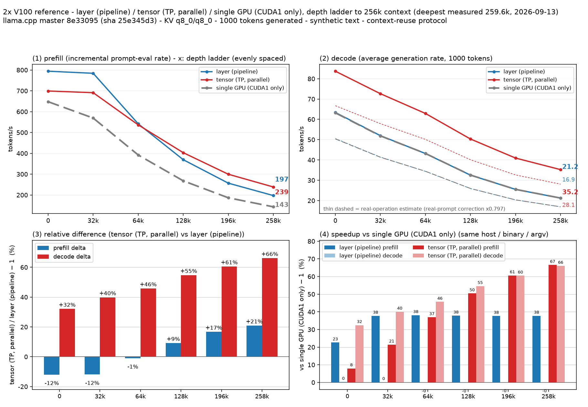
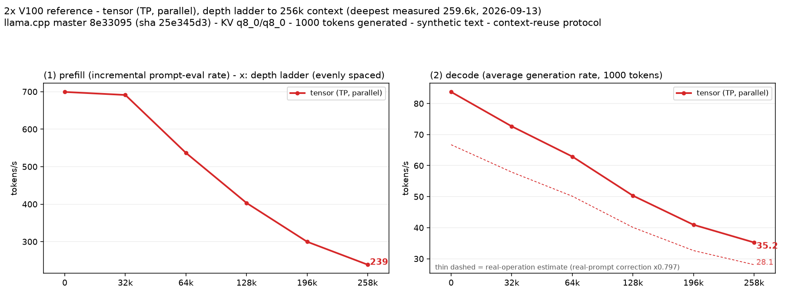

**日本語版はこちら → [README.ja.md](README.ja.md)**

# llama-split-bench

Measure **which llama.cpp split mode is actually faster on your multi-GPU box** — `--split-mode layer` (pipeline, the default) or `--split-mode tensor` (TP) — and how much a second (or third) GPU really buys.

One config file, one command, no adjustments: for each mode it runs a context-depth ladder up to your target context size, records prefill / decode throughput (including speculative-decoding acceptance), corrects decode with real-prompt measurements, and renders the comparison figure in Japanese and English. The whole workflow is non-interactive and machine-readable — designed to be driven by AI agents as well as humans (see *Designed to be driven by AI agents* below).



*Reference example: 2× Tesla V100 (PG500-216 + V100-PCIE, PCIe 3.0 x8/x8, no NVLink), Qwen3.8-27B UD-Q4_K_M at a 262k target. Result: tensor split wins decode at every depth (+32% at depth 0 → +66% at 260k); layer split's decode equals the single-GPU rate — the split buys VRAM, not speed.*

## Scope, compatibility, audience

**What you get** — per machine, one command: a measured answer (layer vs tensor vs single-GPU), a comparison figure (ja/en), and the raw evidence (`run-info.json`, per-stage JSON, sampler logs) someone else can check.

**Build independence** — the harness only talks to a `llama-server` binary over HTTP (`/completion` and its `timings` fields). There is no SM/architecture-specific code: use a CUDA build for any architecture, or another backend (ROCm, Vulkan, Metal, CPU) — the binary is just a `bench.conf` value. NVIDIA-only extras (foreign-process guard, GPU sampler) auto-degrade to off elsewhere; speculative decoding is optional (`SPEC_ARGS=""`). The server launch command is fully configurable (see the FAQ); `LAUNCH_PREFIX` covers wrappers like `numactl`/`taskset`/`env`. **Validation status:** exercised end-to-end on Linux + CUDA (sm70, 2×V100); other backends/architectures are untested — start with the 4-minute smoke.

**Who it's for** — anyone who has to answer "should I split this model across GPUs, and which way?": workstation builders, single-box LLM operators, and AI agents (next section). The numbers are environment-specific by design; what stays constant across users is the protocol and the evidence format.

## Designed to be driven by AI agents

The whole workflow is non-interactive and machine-checkable, so an agent can run it unattended:

- **One command, one config file** — everything lives in `bench.conf`/`bench.local.conf`; no prompts, no TUIs.
- **Detached by design** — launch with `setsid nohup bash run-bench.sh <tag> … &` and poll `runs/<tag>.log` for the `BENCH-DONE` marker; failures print `BENCH-ABORT: …` and exit non-zero, so callers never have to guess.
- **Machine-readable results** — `run-info.json` (binary sha256, modes/devices, ctx, KV type, launch prefix) plus per-stage `results-*.json`; figures are regenerated from JSON alone (`plot_bench.py --dir …`, no re-measurement).
- **Static gates** — `check.sh` (bash -n, py_compile, optional pyflakes), run-dir reuse protection, and a foreign-process guard that aborts if someone else starts compute on the measured GPUs.
- **Deterministic protocol** — fixed stages, fixed generation length, fixed corrections: runs compare like runs.

## What it measures (and why this way)

1. **Depth ladder, context reuse** — the server receives one prompt that grows stage by stage (0 → 32k → … → target). Each stage reports the *incremental* prefill rate (`prompt_per_second`), then generates N tokens (`ignore_eos`, 1000 by default) whose steady rate is decode (`predicted_per_second`). This mirrors real agent traffic: a long prompt, then generation at depth.
2. **Depth-0 prefill, fresh prompts** — prompts of 512/2048/8192 tokens with `cache_prompt=false` give the honest prefill rate at an empty context. (The ladder's first stage is an 11-token prompt; its prefill number is an artifact — the plotter never uses it.)
3. **Speculative decoding / MTP acceptance** — with `--spec-type draft-mtp`, decode speed depends on how many draft tokens are accepted. The ladder's synthetic filler text accepts almost everything (≈1.0 → optimistic), so the tool additionally runs real prompts (3 built-in workload proxies, temp 0.7 / top_p 0.9) on one mode and derives a correction factor (typically 0.7–0.9). The factor is applied *uniformly to every mode and depth* and drawn as the thin dashed "real-operation estimate" curves. Absolute decode numbers depend on acceptance; the relative layer-vs-tensor comparison does not.
4. **Evidence recorded per run** — binary sha256 + version, full mode/device table, KV cache types, per-stage acceptance, 2 s GPU sampler (temps/power, optional fan PWM), and a foreign-process guard that aborts if someone else starts compute on the measured GPUs.

## Quickstart

Requirements: Linux, one or more GPUs supported by your llama.cpp build, `python3` (stdlib for measurement; `matplotlib` for figures), and enough disk for `runs/` (a few MB per run plus optional response dumps). The GPU sampler and the foreign-process guard use `nvidia-smi` and `CUDA<n>` device names; on other backends they degrade gracefully (guard disabled, fan logging off).

```bash
git clone https://github.com/kuraneko1/llama-split-bench
cd llama-split-bench

# one-time: python env for figures
python3 -m venv ~/.venvs/bench-plot
~/.venvs/bench-plot/bin/pip install matplotlib

# machine-specific config (git-ignored)
cp bench.conf bench.local.conf
$EDITOR bench.local.conf        # set MODEL (required), MMPROJ (optional), DEVICES, CTX …

./list-devices.sh               # show llama.cpp devices + GPU inventory

# full run: layer + tensor on all DEVICES, single-GPU baseline
setsid nohup bash run-bench.sh my-run-1 > runs/my-run-1.log 2>&1 &
tail -f runs/my-run-1.log       # wait for BENCH-DONE (~1 h for a 3-mode 262k run)
```

Figures land next to the raw JSON: `runs/my-run-1/split-bench-ja.png` and `split-bench-en.png`.

Smoke test first (~4 min, exercises the full pipeline with a tiny ladder):

```bash
bash run-bench.sh smoke --stages 0,4000 --n-predict 100 --ctx 8192 \
    --pp0-sizes 512,2048 --modes layer,single --no-real
```

One mode, full ladder (e.g. to reproduce a single arm):

```bash
bash run-bench.sh t1 --modes tensor
```

Just the prefill/decode numbers for one configuration (no layer/tensor comparison):

```bash
bash run-bench.sh p1 --profile                              # current DEVICES, default split -> 2-panel figure
bash run-bench.sh p2 --mode-spec "myarm|CUDA0,CUDA1|tensor" # arbitrary arm(s) with custom names
```



*Example `--profile` output (reference box): prefill and decode for a single arm — tensor split, 262k ladder. Same protocol, 2-panel figure, no comparison required. Thin dashed = real-operation estimate.*

## Reading the figure

| panel | content |
|---|---|
| ① | prefill vs depth (depth-0 point = fresh-prompt measurement) |
| ② | decode vs depth — solid = measured; **thin dashed = real-operation estimate** (measured × real-prompt factor) |
| ③ | relative difference between the first two series (e.g. tensor vs layer) |
| ④ | speedup vs the baseline mode (default: `single`; auto-hidden when that mode is not in the run) |

Endpoint numbers sit inside the right edge of each panel — bold = measured, light = estimate. Every element can be toggled without re-measuring; **`--vs off` (or `VS_PANEL=off` in `bench.conf`, which applies to the whole run) removes the 4th panel and reflows the figure**:

| option | flag / config | effect |
|---|---|---|
| vs-single panel | `--vs off` · `VS_PANEL=off` (bench.conf) | **panel ④ disappears** — for runs without a single-GPU baseline, or when you don't want the comparison |
| real-operation estimate | `--estimate off` · `--no-real` (at run time) | the thin dashed curves come from this run's real-prompt factor and appear for **every measured series** — whether or not a single-GPU baseline is included; `--estimate off` hides them, `--no-real` skips measuring the factor at all |
| baseline mode | `--baseline <mode>` · `BASELINE` (bench.conf) | which mode panel ④ compares against (default `single`; auto-hidden when that mode is not in the run) |
| series subset | `--series layer,tensor` | plot only the given runs |
| language | `--lang ja` · `--lang en` | Japanese / English figure |

Re-render without re-measuring:

```bash
~/.venvs/bench-plot/bin/python plot_bench.py --dir runs/my-run-1 \
    --series layer,tensor --lang en --vs off
```

## FAQ

- **So, layer or tensor?** On the reference 2×V100 box: tensor, for decode-heavy C=1 serving, at every depth; layer only if you need the VRAM split and accept decode == single-GPU. On other machines the crossover may differ — that is exactly what this tool measures.
- **What about `--split-mode row`?** Deprecated upstream; not measured.
- **Does `GGML_CUDA_P2P=1` help?** On the reference box it was a measured no-op (PHY: internal AllReduce already saturates ~6.6 GB/s unidirectional at x8; NCCL not linked). Try it on yours — runs are cheap to repeat.
- **`NCCL not compiled` / `backend sampling ... CPU` server warnings?** Harmless for this benchmark.
- **Why 1000 generated tokens per stage?** Steady-state decode needs a few hundred tokens to average out MTP acceptance variance; 100 fits pipelines but 1000 fits figures.
- **My model isn't Qwen / doesn't support MTP.** Leave `SPEC_ARGS` empty in `bench.conf`; everything else is model-agnostic. The real-prompt factor prompt set can be replaced with `measure_real.py --prompts-json` (see the script).
- **Re-running with the same tag?** Refused by design: stale `results-*-pp0.json` / `results-real.json` from the older run would silently mix into the new figures. Use a new tag (`--reuse` overrides, only for deliberate appends).
- **Can I skip the single-GPU comparison?** Yes, two ways: don't run that mode (`--modes layer,tensor` — panel ④ auto-hides and you save the single-GPU run time), or keep the run and set `VS_PANEL=off` in `bench.conf` (for a one-off re-render: `--vs off`).
- **Can I change how the server is launched?** The argv is assembled from `bench.conf` (`BIN`, `LAUNCH_PREFIX`, `MODEL`, `MMPROJ`, `DEVICES`/`MODES`, `NGL`, `THREADS`, `FA`, `JINJA`, `KV_K/V`, `SPEC_ARGS`, `SPEC_DEVICE`, `LOAD_MODE`, `CACHE_ARGS`, `HOST`, `PORT`, `EXTRA_ARGS`). Append arbitrary flags with `EXTRA_ARGS`, prefix wrappers (`numactl`, `taskset`, `env …`) with `LAUNCH_PREFIX`, or point `BIN` at a wrapper script. The exact argv inputs and binary hash are recorded in `run-info.json` for every run — that is the evidence other people compare against.
- **Can I measure one configuration only (no comparison)?** Yes: `--profile` measures the current `DEVICES` as a single arm and renders the 2-panel prefill/decode figure; `--mode-spec "name|device|split"` (repeatable) defines arbitrary arms, e.g. `--mode-spec "gpu0|CUDA0|"` for a single-card profile.

## Files

| file | role |
|---|---|
| `bench.conf` | every tunable (also `bench.local.conf`, git-ignored, for per-machine values) |
| `run-bench.sh` | orchestrator: per-mode server → ladder → depth-0 → real prompts → run-info → figures |
| `measure_ladder.py` | depth ladder (context reuse), MTP acceptance, foreign-process guard |
| `measure_pp0.py` | depth-0 fresh-prompt prefill |
| `measure_real.py` | real-prompt correction runs |
| `plot_bench.py` | figure rendering — conventions frozen in code (panels, endpoint numbers, toggles) |
| `list-devices.sh` | device inventory helper |
| `check.sh` | static checks (bash -n, py_compile, optional pyflakes) — run before committing |
| `runs/<tag>/` | per-run results: raw JSON, server logs, sampler logs, figures |

## License

MIT
